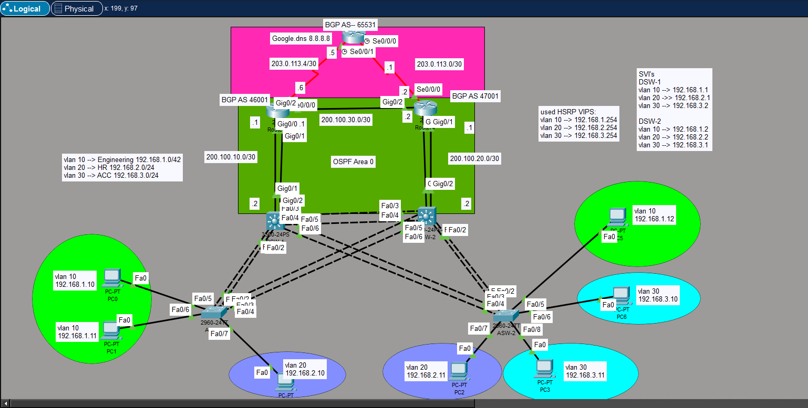

# 🚀 CCNA / CCNP Practice Lab

## 📌 Overview
This lab was created to practice and examine multiple core networking protocols used in enterprise environments.  
The main goal of this topology is to understand protocol interaction and redundancy mechanisms.

---

## 🛠️ Technologies Used

- **EtherChannel (LACP)**
- **HSRP (Hot Standby Router Protocol)**
- **VLAN Segmentation**
- **OSPF (Open Shortest Path First)**
- **BGP (Border Gateway Protocol)**

---

## 🎯 Lab Objectives

- Configure Layer 2 redundancy using EtherChannel
- Implement First Hop Redundancy using HSRP
- Design and segment networks using VLANs
- Configure dynamic routing with OSPF (IGP)
- Implement external routing using BGP (EGP)
- Analyze protocol behavior and interaction

---

## ⚠️ Limitations

- NAT was **not implemented** in this lab.
- Because of that, external internet simulation was limited.
- NAT configuration is planned as a future improvement.

---

## 🧪 Purpose

This lab was built for:

- Exam preparation (CCNA / CCNP level)
- Protocol behavior testing
- Understanding redundancy and routing design

---

## 🖥️ Network Topology

---

## 📚 Key Learning Outcomes

- Layer 2 and Layer 3 protocol integration
- Redundancy and high availability design
- Dynamic routing configuration and troubleshooting
- Enterprise-style topology simulation

---

## 🔮 Future Improvements

- Add NAT configuration
- Add ACL security policies
- Implement Port Security
- Introduce DHCP and DNS services
- Add IPv6 configuration

---

## 👨‍💻 Author

Created for networking practice and protocol examination.